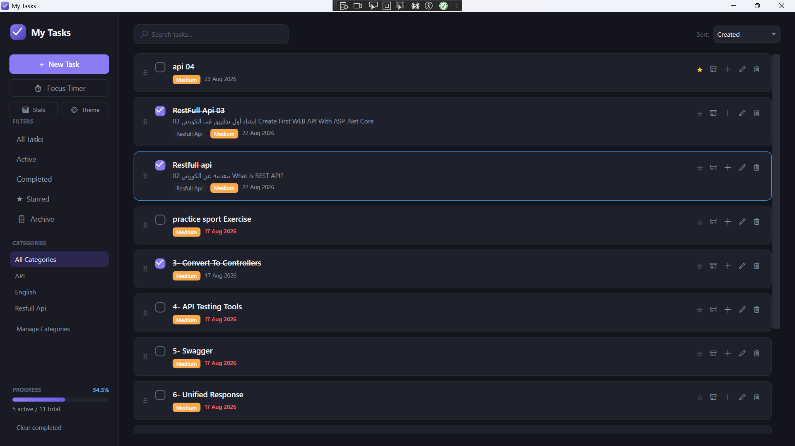
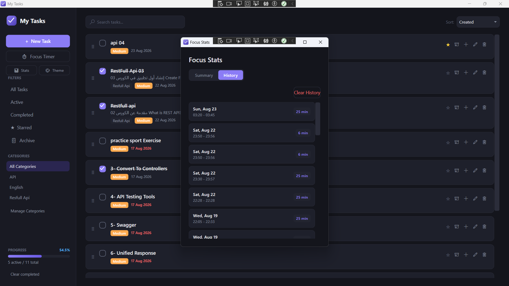
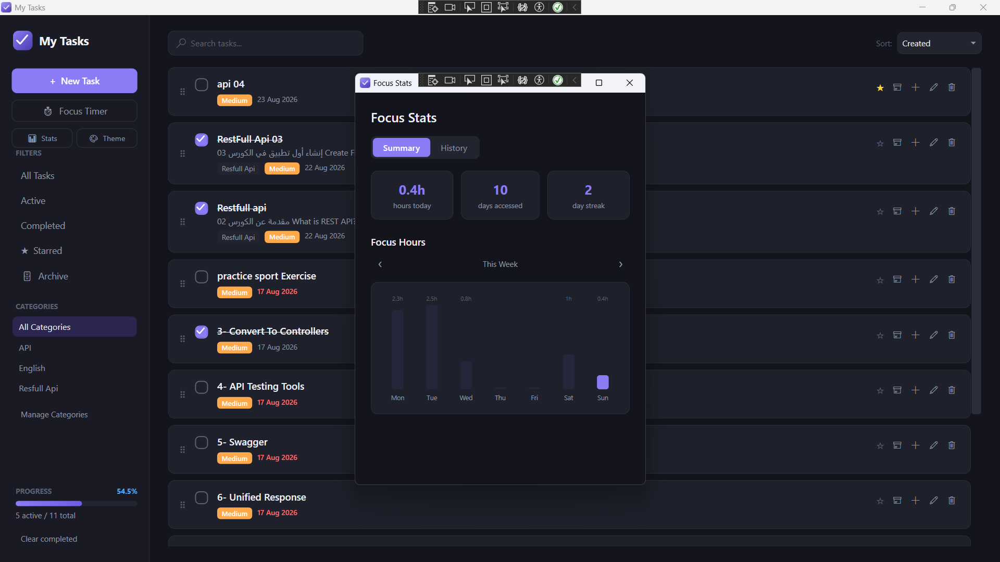
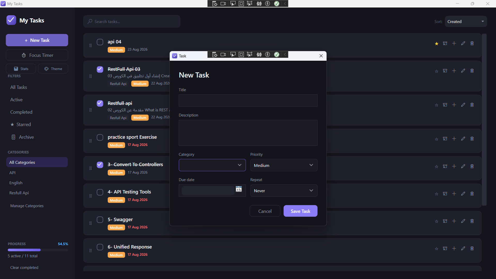
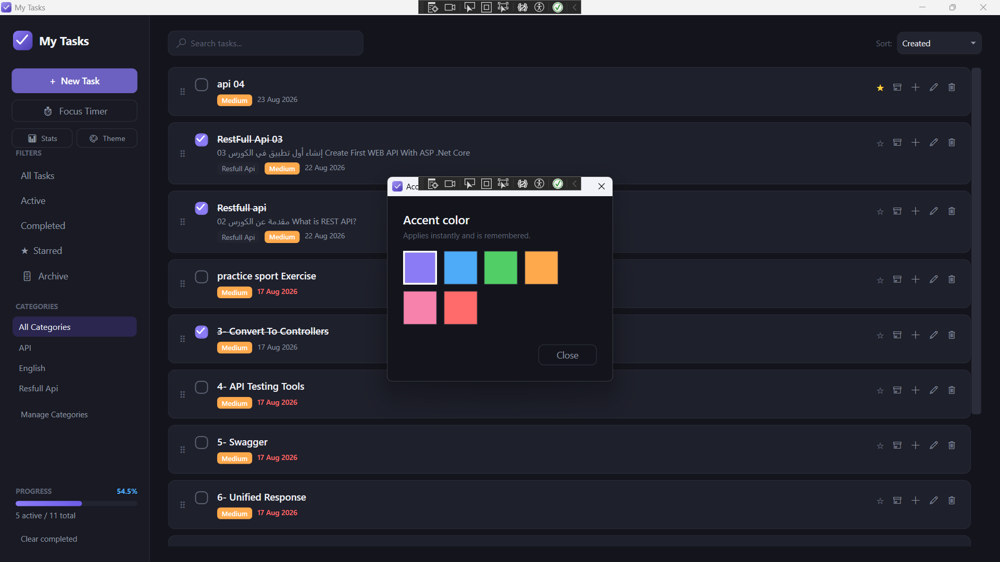
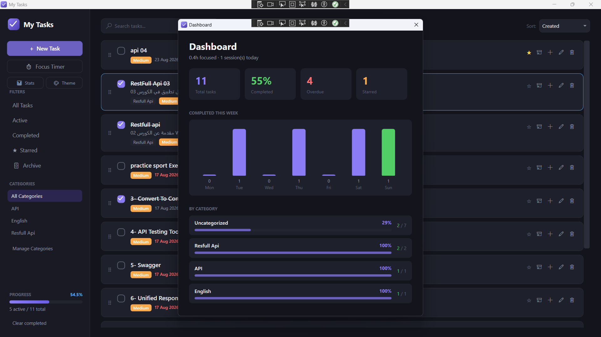
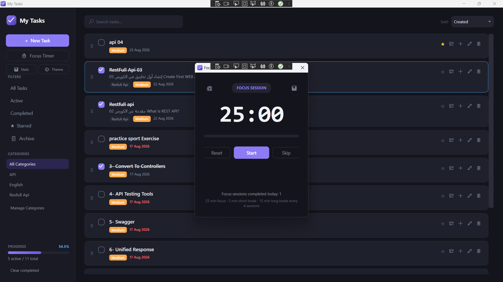

# My Tasks — Notion-Style Todo App for Windows


A fast, fully offline **task management desktop app** built with **WPF + C# (.NET 8)** and **SQLite via Entity Framework Core** — combining a classic todo workflow with Notion-inspired features: sub-tasks, tags, emoji icons, file attachments, recurring tasks, an archive, and a Pomodoro focus timer with statistics.

All data is stored locally in `%AppData%\TodoApp\todo.db`. No accounts, no cloud, no telemetry.

---

## Screenshots

### Main View


### Task Detail & New Task


### Dashboard


### Focus Timer


### Focus Stats



### Theme Picker


### Multi-Select


---

## ✨ Features

### Task Management
- **Full CRUD** — create, edit, and delete tasks with instant persistence
- **Priorities** (Low / Medium / High) with color-coded indicators
- **Due dates** with automatic overdue highlighting in red
- **Categories** with sidebar filtering and a manage dialog
- **Instant search** across titles, descriptions, tags, and sub-tasks
- **Filters**: All / Active / Completed / ★ Starred / 🗄 Archive
- **Sorting**: Manual (drag & drop), Due Date, Priority, or Creation Date

### Notion-Inspired Extras
- **Sub-tasks** — break any task down; progress is tracked automatically, and completing a parent completes its children
- **Task detail page** — double-click any card to open a full-page editor
- **Emoji icons & tags** — personalize tasks like Notion pages
- **File attachments** — attach files to tasks; double-click to open them
- **Recurring tasks** — Daily / Weekly / Monthly; completing one spawns the next occurrence automatically
- **Starred tasks** — flag important work with one click
- **Archive** — hide finished work without deleting it; restore anytime
- **Multi-select** — `Ctrl+Click` cards for bulk delete
- **Undo delete** — `Ctrl+Z` restores the last deletion, sub-task hierarchy intact

### 🍅 Pomodoro Focus Timer
- Classic technique: focus → short break → long break after N sessions
- Fully configurable durations (persisted between runs)
- Auto-advance between phases with an audio chime
- **Statistics dashboard**: hours focused today, day streak, weekly bar chart, full session history

### 📊 Dashboard
- At-a-glance stat cards: total, completion %, overdue, starred
- "Completed this week" bar chart
- Per-category progress breakdown

### 🎨 Customization & Polish
- **6 accent color themes** applied live and remembered across sessions
- Complete dark theme — every control styled, no white surprises
- Smooth animations throughout (spring buttons, fade-ins, animated progress)
- Drag-and-drop task reordering with a dedicated handle

### 🔧 Under the Hood
| | |
|---|---|
| Architecture | Clean MVVM + Repository pattern |
| Dependency Injection | `Microsoft.Extensions.DependencyInjection` |
| Data | EF Core 8 + SQLite, auto-migrating schema |
| Backups | Automatic on startup (last 5 kept) |
| Testing | xUnit — 50 tests covering models, repositories, and view models |

### ⌨️ Keyboard Shortcuts
| Shortcut | Action |
|---|---|
| `Ctrl+N` | New task |
| `Ctrl+Z` | Undo last delete |
| `Ctrl+Click` | Multi-select cards |

---

## 🚀 Getting Started

### Prerequisites
- **Windows** 10/11 (WPF is Windows-only)
- [.NET 8 SDK](https://dotnet.microsoft.com/download/dotnet/8.0)

### Run
```bash
git clone https://github.com/EngMohamedNowar/TodoApp.git
cd TodoApp
dotnet run --project TodoApp
```

Or open `TodoApp.sln` in Visual Studio 2022 and press `F5`.

### Run Tests
```bash
dotnet test
```

---

## 📁 Project Structure

```
TodoApp/
├── Models/          → EF Core entities (TodoItem, FocusSession, Category, ...)
├── Data/            → DbContext, schema management, backup service
├── Repositories/    → Repository interfaces + implementations
├── ViewModels/      → MVVM view models + RelayCommand
├── Views/           → Windows (main, detail, pomodoro, dashboard, ...)
├── Converters/      → XAML value converters
├── Behaviors/       → Attached properties (smooth animations)
├── Services/        → Theme engine, settings persistence
└── Assets/          → App icon

TodoApp.Tests/       → xUnit test suite
```

## 💾 Where Is My Data?

Everything lives locally — created automatically on first launch:

```
%AppData%\TodoApp\todo.db        # SQLite database
%AppData%\TodoApp\backups\       # Auto-backups (last 5)
%AppData%\TodoApp\settings.json  # Theme preference
```

The schema evolves safely on upgrade — new columns are added automatically, no manual migration needed.

---

## 🗺 Roadmap

- [ ] Kanban board view
- [ ] Calendar view
- [ ] Export/import (JSON)
- [ ] Task templates
- [ ] Reminders via Windows notifications

---

## 📄 License

MIT — see [LICENSE](LICENSE).

---

Developed by **Eng. Mohamed Nowar**
