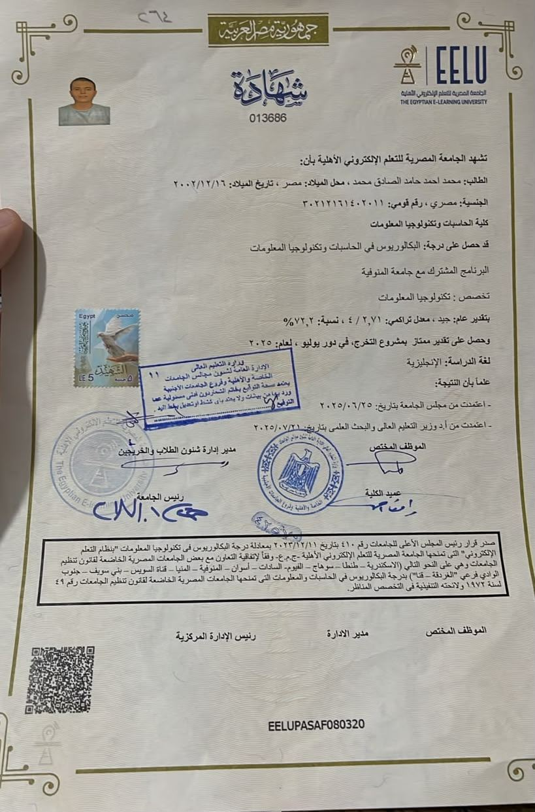
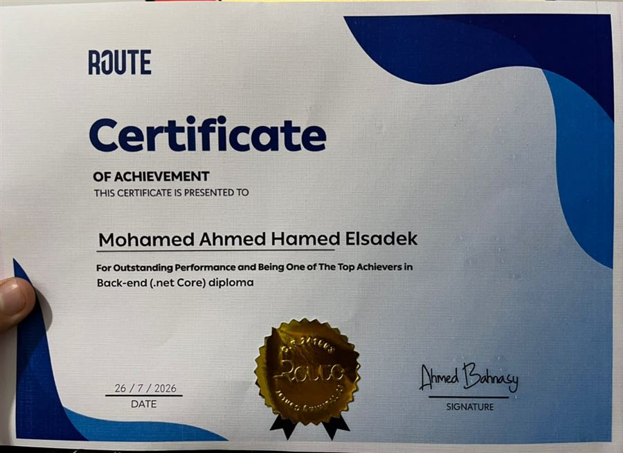
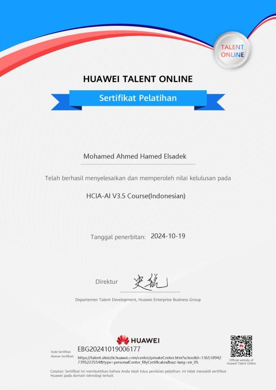
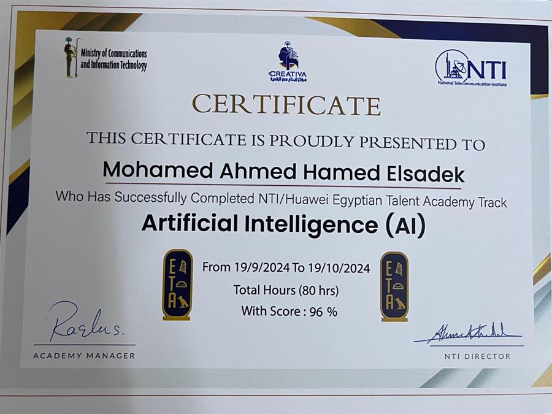
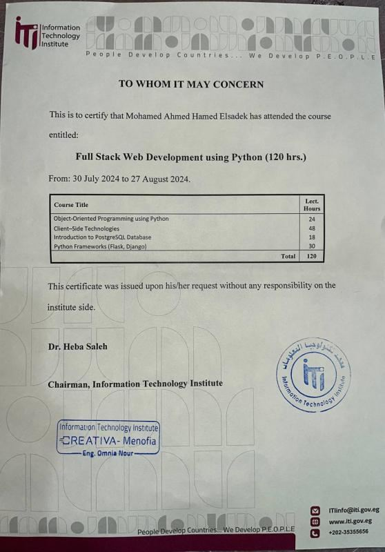
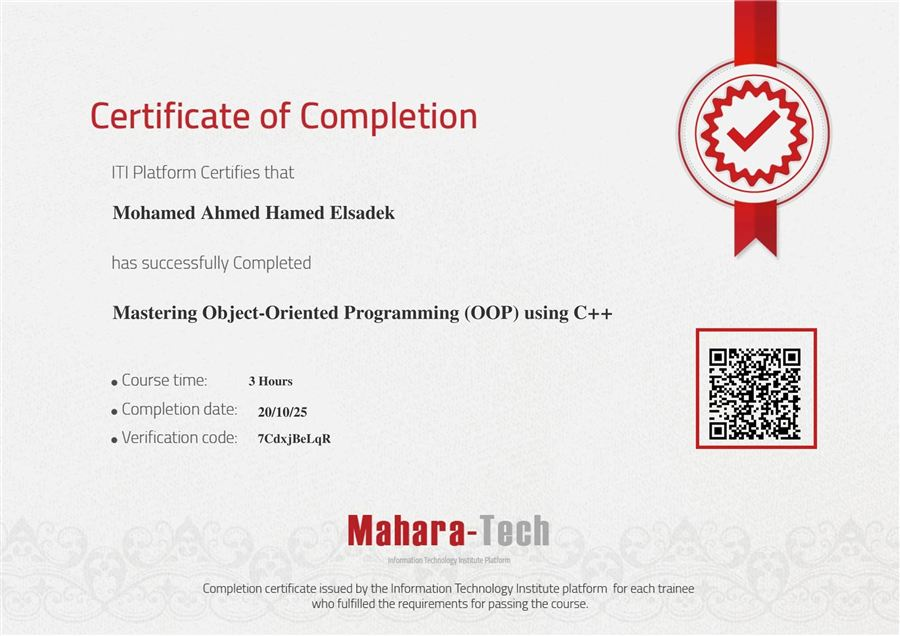
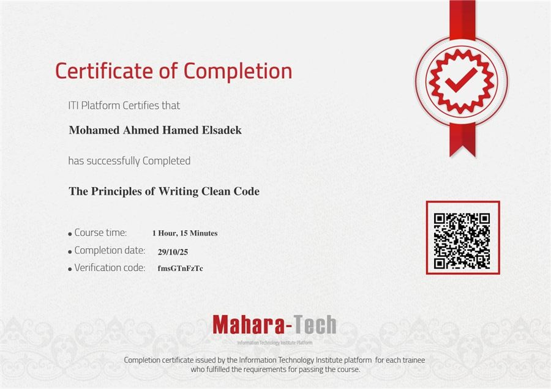
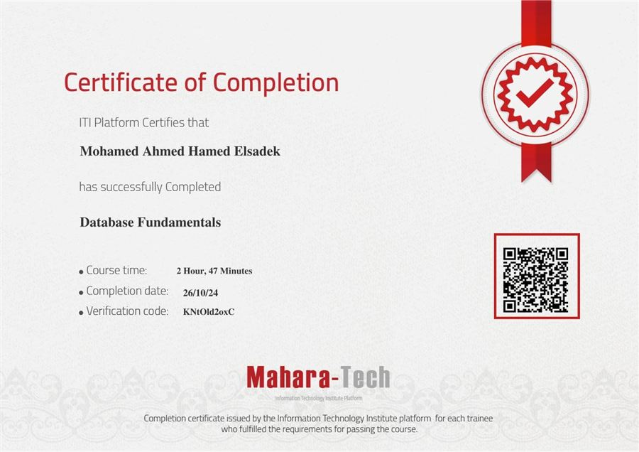

<div align="center">

<!-- Typing SVG Header -->
<a href="https://git.io/typing-svg">
  
</a>

<br/>

<!-- Badges Row -->

&nbsp;

&nbsp;


</div>

---

## 🧑‍💻 About Me

```csharp
var developer = new Developer
{
    Name = "Mohamed Nowar",
    Title = "Junior .NET Backend Developer",
    Location = "Cairo, Egypt",
    OpenTo = new[] { "on-site", "hybrid", "remote", "freelance" },
    Languages = new[] { "Arabic (Native)", "English (Professional)" },
    Passion = "Building clean, scalable backend systems with .NET",
    CurrentlyLearning = "Microservices & Cloud-Native Development"
};
```

<br/>

---

## 🛠️ Tech Stack

<div align="center">

### Languages & Frameworks


### Tools & Platforms


</div>

<br/>

<div align="center">

#### Core Concepts


</div>

<br/>

---

## 📊 GitHub Stats

<div align="center">


</div>

<div align="center">


</div>

<div align="center">


</div>

---

<!--## 🏆 Activity -->

<!-- <div align="center">


</div> -->

<br/>

---

## 🐍 Contribution Snake

<div align="center">

<picture>
  <source media="(prefers-color-scheme: dark)" srcset="https://raw.githubusercontent.com/EngMohamedNowar/EngMohamedNowar/output/github-snake-dark.svg" />
  <source media="(prefers-color-scheme: light)" srcset="https://raw.githubusercontent.com/EngMohamedNowar/EngMohamedNowar/output/github-snake.svg" />
  
</picture>

</div>

<br/>

---

## 📌 Pinned Projects

<table>
  <tr>
    <td width="50%" valign="top">
      <h3 align="center">🛒 Ecommerce API</h3>
      <p align="center">
        
        
        
        
      </p>
      <p align="center">RESTful e-commerce API with product catalog, cart, orders, and inventory management. JWT auth with role-based access.</p>
      <p align="center">
        <a href="https://github.com/EngMohamedNowar/ECommerce_API">
          
        </a>
      </p>
    </td>
    <td width="50%" valign="top">
      <h3 align="center">🍽️ Restaurant Management System</h3>
      <p align="center">
        
        
        
        
      </p>
      <p align="center">Production-deployed desktop system with ESC/POS thermal printing, Arabic receipt support, and Win32 API integration.</p>
      <p align="center">
        <a href="https://github.com/EngMohamedNowar/RestaurantPOS_DesktopApplication">
          
        </a>
      </p>
    </td>
  </tr>
  <tr>
    <td width="50%" valign="top">
      <h3 align="center">🏋️ Gym Management System</h3>
      <p align="center">
        
        
        
        
      </p>
      <p align="center">Full gym management with member tracking, trainer scheduling, session booking, and membership lifecycle.</p>
      <p align="center">
        <a href="https://github.com/EngMohamedNowar/GymManagementSystem_MVC">
          
        </a>
      </p>
    </td>
    <td width="50%" valign="top">
      <h3 align="center">🎬 Cinema Ticket Reservation API</h3>
      <p align="center">
        
        
        
      </p>
      <p align="center">Movie schedules, seat selection, and ticket booking API with JWT auth and role-based permissions.</p>
      <p align="center">
        <a href="https://github.com/EngMohamedNowar/CinemaTicketsReservationAPI">
          
        </a>
      </p>
    </td>
  </tr>
  <tr>
    <td width="50%" valign="top">
      <h3 align="center">✅ My Tasks — Todo App</h3>
      <p align="center">
        
        
        
        
        
      </p>
      <p align="center">Notion-style task manager with sub-tasks, recurring tasks, Pomodoro timer, dashboard, theming, and 50 unit tests. Clean MVVM + Repository pattern.</p>
      <p align="center">
        <a href="https://github.com/EngMohamedNowar/TodoApp">
          
        </a>
      </p>
    </td>
    <td width="50%" valign="top">
      <h3 align="center">☕ Coffee Store API</h3>
      <p align="center">
        
        
        
        
        
      </p>
      <p align="center">Coffee catalogue &amp; basket API on .NET 10 with Clean Architecture, Redis caching, JWT auth, docker-compose, and an xUnit suite. In active development.</p>
      <p align="center">
        <a href="https://github.com/EngMohamedNowar/CoffeeStore">
          
        </a>
      </p>
    </td>
  </tr>
</table>

<br/>

---

## 📱 Screenshots

<div align="center">

### ✅ My Tasks — Todo App

<table>
  <tr>
    <td align="center"><strong>Main View</strong><br/></td>
    <td align="center"><strong>Dashboard</strong><br/></td>
  </tr>
</table>

### 🏋️ Gym Management System

<table>
  <tr>
    <td align="center"><strong>Home Page</strong><br/></td>
    <td align="center"><strong>Admin Dashboard</strong><br/></td>
  </tr>
</table>

### 🍕 Restaurant POS System

<table>
  <tr>
    <td align="center"><strong>POS Admin</strong><br/></td>
    <td align="center"><strong>Daily Report</strong><br/></td>
  </tr>
</table>

</div>

<br/>

---

## 🎯 What I Bring to the Table

<table>
  <tr>
    <td align="center" width="33%">
      <h3>🏗️ Architecture</h3>
      <p>Clean Architecture<br/>Repository Pattern<br/>Unit of Work<br/>CQRS &amp; MediatR<br/>Three-Layer Architecture</p>
    </td>
    <td align="center" width="33%">
      <h3>🔐 Security</h3>
      <p>JWT Authentication<br/>Role-Based Authorization<br/>ASP.NET Core Identity<br/>Token-Based Auth</p>
    </td>
    <td align="center" width="33%">
      <h3>💾 Data</h3>
      <p>SQL Server<br/>PostgreSQL<br/>Redis Caching<br/>EF Core<br/>Django ORM</p>
    </td>
  </tr>
</table>

<br/>

---

## 🎓 Certifications

<div align="center">

[](https://drive.google.com/drive/folders/1r_ONbtYPHxP2p0TOfOcmKEdz4MIbd0Jt?usp=sharing)

</div>

<table>
  <tr>
    <td align="center" width="33%">
      <a href="https://drive.google.com/file/d/1KATof9qObGF7jttGQBih6Z8Zl4Jj4Iqj/view?usp=sharing">
        <br/>
        <strong>🎓 B.Sc. Graduation Certificate</strong>
      </a>
      <br/><sub>Egyptian E-Learning University · 2025</sub>
    </td>
    <td align="center" width="33%">
      <a href="https://drive.google.com/file/d/1EYLlRJlzx50N_8i8D6bMJNSKNTpoiuOB/view?usp=sharing">
        <br/>
        <strong>🌐 ASP.NET Core Back-End</strong>
      </a>
      <br/><sub>Route Academy · Dec 2025 – Jul 2026</sub>
    </td>
    <td align="center" width="33%">
      <a href="https://drive.google.com/file/d/1Uql1cZfbJ_mJwTDXv5ZWomS8w9iw30lJ/view?usp=sharing">
        <br/>
        <strong>🤖 HCIA-AI V3.5</strong>
      </a>
      <br/><sub>Huawei · Score 96% · 2024</sub>
    </td>
  </tr>
  <tr>
    <td align="center" width="33%">
      <a href="https://drive.google.com/file/d/19Fk6P6v0B3IubjQlkJDMwB6HSV3vRBOm/view?usp=sharing">
        <br/>
        <strong>🧠 AI Talent Academy Track</strong>
      </a>
      <br/><sub>NTI × Huawei · 80 hrs · Score 96% · 2024</sub>
    </td>
    <td align="center" width="33%">
      <a href="https://drive.google.com/file/d/13mJhYLAQvHMASVqRJ1wvc61cuEPA7h6g/view?usp=sharing">
        <br/>
        <strong>🐍 Full Stack Python</strong>
      </a>
      <br/><sub>ITI · 120 Hours · Jul – Aug 2024</sub>
    </td>
    <td align="center" width="33%">
      <a href="https://drive.google.com/file/d/1m_PpMnaFMPOwi3jKf3DjCYNt4sfYoS3r/view?usp=sharing">
        <br/>
        <strong>🧩 Mastering OOP using C++</strong>
      </a>
      <br/><sub>ITI Platform · Oct 2025</sub>
    </td>
  </tr>
  <tr>
    <td align="center" width="33%">
      <a href="https://drive.google.com/file/d/1aBJj-ccxO_rRc7DQUeFpHM9x783MTAe7/view?usp=sharing">
        <br/>
        <strong>✨ Principles of Clean Code</strong>
      </a>
      <br/><sub>ITI Platform · Oct 2025</sub>
    </td>
    <td align="center" width="33%">
      <a href="https://drive.google.com/file/d/1cxs0XJfog1LW_tvE4f6Igs_CmpSj8fjY/view?usp=sharing">
        <br/>
        <strong>🗄️ Database Fundamentals</strong>
      </a>
      <br/><sub>ITI Platform · Oct 2024</sub>
    </td>
  </tr>
</table>

<br/>

---

## 📫 Let's Connect

<div align="center">

<a href="https://linkedin.com/in/mohamednowar">
  
</a>
<a href="https://engmohamednowar.github.io/portfolio/">
  
</a>
<a href="mailto:mohamednowar2002@gmail.com">
  
</a>
<br/>
<a href="https://github.com/EngMohamedNowar">
  
</a>
<a href="https://wa.me/201557722675">
  
</a>
<a href="https://x.com/mohamednowar_">
  
</a>
<br/>
<a href="https://instagram.com/mohamednowar_">
  
</a>

</div>

<br/>

---

<div align="center">

### *Building backend systems that are as clean as the code that powers them.* 🚀

<br/>

[](https://git.io/typing-svg)

</div>
